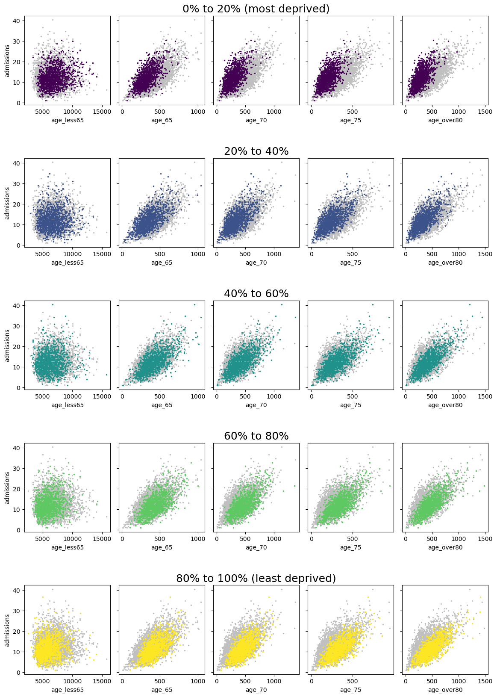
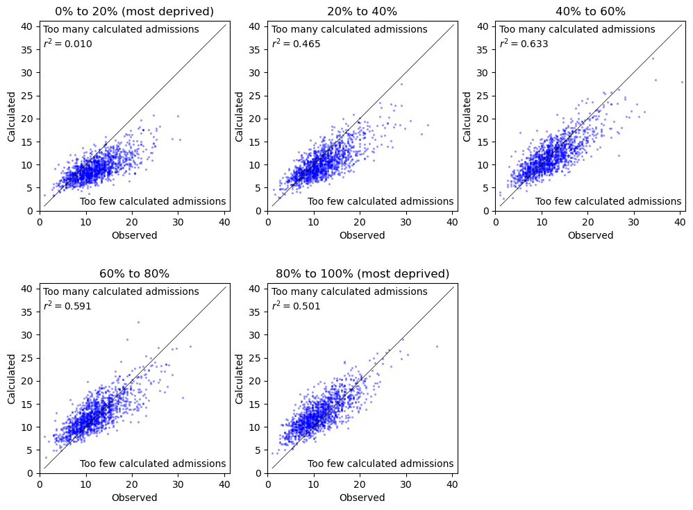
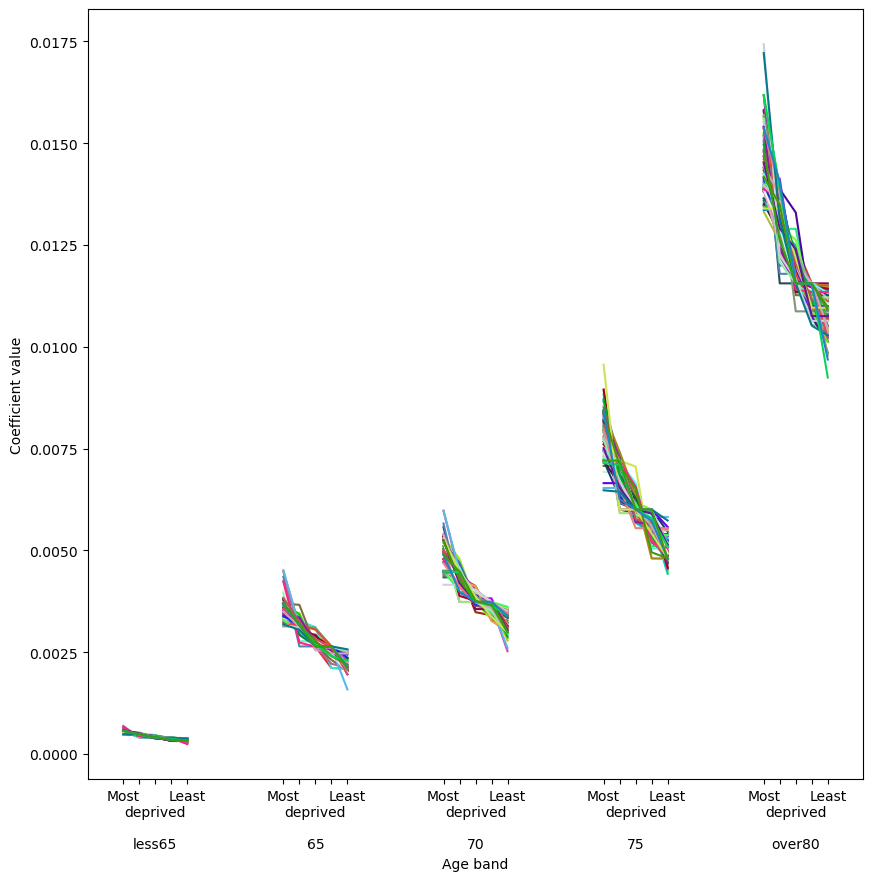

# Stroke admissions prediction using deprivation

Want to predict number of stroke admissions when we know only the population demographics, specifically the number of people of various ages. Assume that in general older people are more likely to have strokes than younger people and so the age breakdown matters. Use the age bands: under 65, 65 to 70, 70 to 75, 75 to 80, and over 80.

Data available at the MSOA level:
+ number of admissions from 2017 to 2019, from Hospital Episode Statistics (HES).
+ number of people in each age band in mid-2020.
+ deprivation ranking (Index of Multiple Deprivation, IMD).

Data available at the national level:
+ number of stroke admissions from people in each age band from 2017 to 2019, from the Sentinel Stroke National Audit Programme (SSNAP).
+ number of people in each age band in January 2019.

Start by using the national-level data to find the pattern of stroke incidence with age, and then use the MSOA-level data to add in deprivation level.

## Check data

First, look for any patterns in the MSOA-level admissions and demographic data. Do any pieces of data correlate well with the admissions numbers?

We find that there is a good correlation between the number of people in the older age bands (age over 65) and the admissions numbers. The correlation becomes stronger when the MSOA are split by deprivation ranking. The more deprived areas are associated with more stroke admissions than less deprived areas.

In the following scatter plots, the data from all MSOA is shown in every panel in grey. Then the data from only MSOA in the given deprivation quantile is overplotted in a colour. The x-axis shows the number of people in each age band in an MSOA and the y-axis shows the total number of admissions from each MSOA (note: the admissions are the total from all age bands, not just the age band relevant that to each panel).

The data for the most deprived quantiles (top row, purple points) tend to appear further left and higher up than the least deprived quantiles (bottom row, yellow points). This means that in more deprived areas, fewer people are needed in the older age groups to reach the same number of stroke admissions as in the less deprived areas. In other words, the probability of stroke is higher in more deprived areas.

## Age vs admissions

We have insufficient data to directly calculate the probability of stroke given age band and deprivation level. We have data for the number of admissions in each age band, and the number of admissions from each deprivation level, but not the data for each combination of age band and deprivation level.

First we can calculate the effect on admissions from just age band.
The SSNAP data contains the total number of admissions for each of the above age groups. We can combine this with the total number of people in England in each age band. This gives an estimate of the probability of stroke given a certain age band.

The results are as follows:

| Age Group | Probability of stroke |
| --- | --- |
| Under 65 | 0.04% |
| 65 to 69 | 0.26% |
| 70 to 74 | 0.37% |
| 75 to 79 | 0.60% |
| 80 and over | 1.16% |

### Application to MSOA-level data

We can judge the accuracy of these coefficients by using them with the MSOA-level population data to calculate the number of admissions in each MSOA.
The results can be compared with the observed numbers of admissions in each MSOA from the HES data.

The following scatter plot compares the observed and calculated admissions numbers for all MSOA. It has a black line where the two values are equal. Data points appearing above that line have more calculated than observed admissions, and points below the line have fewer.

We see that the admission numbers are largely under-predicted for the most-deprived MSOAs and slightly over-predicted for the least-deprived MSOAs.

The calculations could be made more accurate by using different coefficients for each deprivation group.
The SSNAP data does not contain the patients' MSOA names and so the admissions cannot be linked to deprivation index directly.
However we can use these derived coefficients as a starting point for finding a new fit using the deprivation data.

## Deprivation & age vs admissions

We can find values for coefficients split by age band and by deprivation level by using an optimiser.
In this case we can't directly calculate the coefficients from the HES data because the observed admission numbers will contain random errors.
The HES data covers only three years and so we expect that by chance some MSOA will have recorded more than the true average and others less than the true average.
This effect wasn't so important with the SSNAP data, which was on the national level, but with typically around 10 annual admissions per MSOA the effect can make a large difference in the HES data.
Therefore the goal is to find a set of coefficients that makes the best possible match to all MSOA simultaneously.

Optimisers require a decent first estimate of the coefficients: the closer the better, and in particular they need to be to the right order of magnitude. Otherwise it's "garbage in, garbage out". For the first estimates, we'll use variations of the coefficients derived from the SSNAP data alone.

We'll use two stages of optimisation:
1. a genetic algorithm to explore a large number of combinations of coefficients, and
2. a minimisation function to increase the precision of the results of the genetic algorithm.

### Genetic algorithm method

We can use the genetic algorithm to compare many sets of coefficients, select the best, and combine sets to create brand-new sets. This allows us to explore as much parameter space (try as many combinations of coefficients) as possible.

There are some conditions imposed on the sets of coefficients.
We assume that probability of stroke should increase with age, as was seen with the SSNAP-derived coefficients, and with deprivation. Any sets of coefficients that are generated are adjusted if necessary so that these conditions are always met.

The fitness of a set of coefficients is judged by:
+ calculating the difference between predicted and observed total admissions, then
+ scaling these by a "wrongness factor" derived from comparing the predicted and observed admissions in each age band.

The "wrongness factor" discourages the preference for sets of coefficients where most values are zero and only the values for one or two age bands are fine-tuned to make a good match for the total admissions. 

The genetic algorithm starts with 300 "individuals" or sets of coefficients. These are picked from 2002 options. The options are various combinations of scaled values of the SSNAP coefficients: for example, the most-deprived areas might use the starting values multiplied by 1.4, the least-deprived areas 0.6, and the other areas scales in between.

In each generation of the algorithm, the individuals are paired up and given a chance of swapping over a random string of their coefficients (crossover). Then the individuals have a chance of their coefficients being nudged slightly, for example from a scale of 1.4 to 1.32 (mutation). The algorithm uses high mutation and crossover rates to sample as much variation in the coefficient values as possible.
Then a set of individuals are picked out to continue to the next generation with better sets of coefficients (according to the fitness tests) being more likely to be picked.

The simulation continues until either 1000 generations have passed or all of the individuals have similar coefficients (standard deviation is less than 5% of the mean for each coefficient). When all individuals are so similar, there is not much further improvement to be gained from crossover.

We run the simulation 100 times with different selections of starting individuals each time. We keep a copy of the best individual from the final generation of each of the 100 simulations.

### Genetic algorithm results

The resulting best 100 individuals are shown in the following line plots as a way to judge how similar the results are. Each of the 100 sets of coefficients has a different colour.

The 100 sets of coefficients have not converged on a single set of consistently good values. Even when rounded to one significant figure, the results are not consistent.

To see if the results will converge, we can use a second optimisation step to increase the precision of the coefficients.

### Minimisation method

The minimisation function takes a set of coefficients and adjusts the values to find the set that minimises the error in some function. In this case, it will minimise the difference between calculated and observed total admissions (modified by the "wrongness factor").
Because it is unlikely that the genetic algorithm would have generated the best coefficients by chance, the minimisation can take each of the 100 sets of coefficients and fine-tune them to the best possible combination that is near these starting values.

Minimisation works best when the initial guess is close to the true best values. However, the results of the genetic algorithm did not converge to a small set of values. This could mean that there are a large number of sets of coefficients that give very good results (there are many local minima). To increase the chances of finding the true best values (global minimum), we use simulated annealing. This basically allows the optimiser to consider using a set of coefficients that is not quite as good as its last attempt, but that has the potential to be fine-tuned to something even better.

The minimisation is run separately on each of the 100 sets of best coefficients from the genetic algorithm simulations.

### Minimisation results

We find 100 sets of minimised values.
They still haven't converged onto one set of coefficients!
This implies that there are many combinations of coefficients that are all pretty much as good as each other.
In that case, there's no sense in reporting the coefficients too precisely because we know that any small adjustment in values won't drastically affect the accuracy of the results. Instead we only keep the coefficients to one significant figure for all age bands except the over 80 band, which has two significant figures because its values are typically an order of magnitude larger than most of the others.

Before rounding, we calculate the r-squared values to assess the accuracy of the calculated vs observed admission numbers for each of the 100 sets of results.
One of these sets has a slightly higher r-squared value than the rest: it is the only r-squared value that rounds to 0.594.
However all 100 results have r-squared values that round to 0.591 or higher.

We use the best set of coefficients as the final values and use the complete set of 100 sets to judge their precision using the range of values of each coefficient.

## Results

We use the following probabilities of stroke (and minimum-maximum range of values) by age band and deprivation level:

| Deprivation quantile | Under 65 | 65 to 69 | 70 to 74 | 75 to 80 | Over 80 |
| --- | --- | --- | --- | --- | --- |
| 0% to 20% (most deprived) | 0.06% (0.05%--0.07%) | 0.3% (0.3%--0.5%) | 0.7% (0.4%--0.7%) | 0.7% (0.6%--0.9%) | 1.2% (1.2%--1.5%) |
| 20% to 40% | 0.05% (0.05%--0.06%) | 0.3% (0.3%--0.4%) | 0.5% (0.4%--0.5%) | 0.6% (0.6%--0.8%) | 1.2% (1.2%--1.3%) |
| 40% to 60% | 0.04% (0.04%--0.05%) | 0.3% (0.2%--0.3%) | 0.3% (0.3%--0.4%) | 0.6% (0.5%--0.7%) | 1.2% (1.2%--1.2%) |
| 60% to 80% | 0.04% (0.03%--0.04%) | 0.3% (0.2%--0.3%) | 0.3% (0.3%--0.4%) | 0.6% (0.5%--0.6%) | 1.2% (1.1%--1.2%) |
| 80% to 100% (least deprived) | 0.02% (0.02%--0.03%) | 0.2% (0.1%--0.3%) | 0.3% (0.3%--0.4%) | 0.6% (0.5%--0.6%) | 1.2% (1.1%--1.2%) |

### Calculate admissions by MSOA

We can use these coefficients to calculate the admissions for each MSOA and see whether the accuracy has improved compared with the starting SSNAP-derived coefficients.

The following scatter plot shows the admissions for all MSOA:

There is less variation from the equality diagonal line for the derived coefficients than for the SSNAP coefficients. The r-squared values have also increased from 0.46 for the SSNAP-derived coefficients to 0.59 for these coefficients.

The following plots contain the same data as above but split into separate panels for each deprivation quantile.

While previously there was a noticeably worse fit for the more-deprived areas, this effect has reduced when using the final coefficients. For example, the r-squared value for only the most-deprived areas was previously 0.01 (atrocious!) and is now 0.49 (better!).

The total admission numbers in England are as follows:

| Observed | SSNAP coefficients | Calculated | Minimum coeffs | Maximum coeffs |
| --- | --- | --- | --- | --- |
| 80958.0 | 77467.1 | 80597.9 | 72617.8 | 91071.4 |

The "minimum coeffs" and "maximum coeffs" columns use the smallest and largest coefficients in the range of values given in the final results table.
This gives a worst-case scenario for the accuracy of the admissions numbers.
We see that using this extreme range of values adds or subtracts around 10% from the admissions numbers for the "best" coefficients.

### Unknown deprivation quantile

As a further test of the derived coefficients, we can compare the admissions numbers when we deliberately use the wrong set of coefficients.
We pick out an MSOA in the middle deprivation quantile and with these population numbers...

| Under 65 | 65 to 69 | 70 to 74 | 75 to 79 | Over 80 |
| --- | --- | --- | --- | --- |
| 6710 | 476 | 450 | 360 | 528 |

... and use the final coefficients for each deprivation level to calculate the following numbers of admissions:

| Observed | 0-20% (most deprived) | 20-40% | 40-60% | 60-80% | 80-100% (least deprived) | 
| --- | --- | --- | --- | --- | --- |
| 14.3 | 17.5 | 15.5 | 14.0 | 14.0 | 12.1 |

So applying the coefficients from the wrong deprivation quantile should make the difference of a handful of admissions.

## Alternative ideas

There is a link between the numbers of patients with good/fair/bad health and admission numbers. However the age data is known more accurately and completely and can more easily be projected into the future than health levels.

The admissions and population data from multiple MSOA in the same deprivation quantile could be summed to create larger arbitrary areas and so reduce the effect of unusual observations (admissions in the observed years being much higher or lower than typical). This idea was excluded from the final analysis because it added a layer of complication without an obvious benefit to the results.

## Conclusion

We have derived a set of coefficients that allow a calculation of admission numbers for stroke from a population given its deprivation level and the number of people in each age band.
